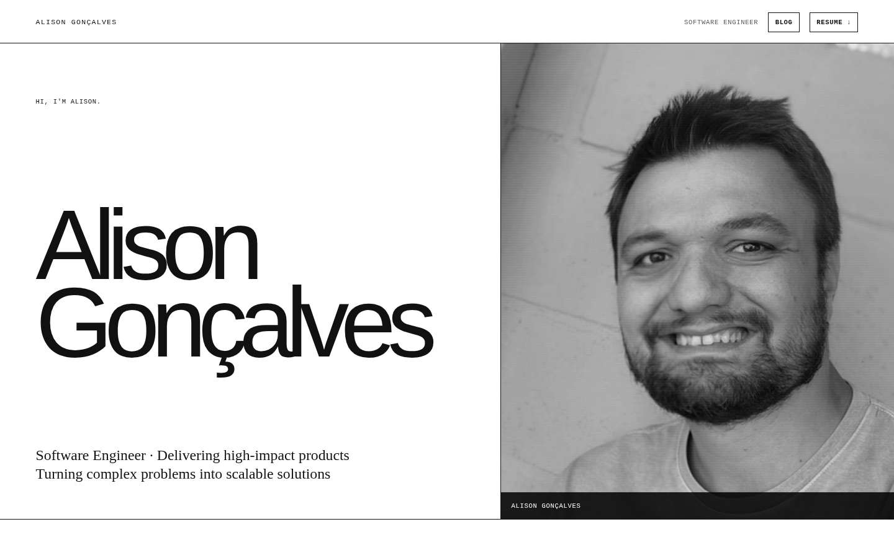
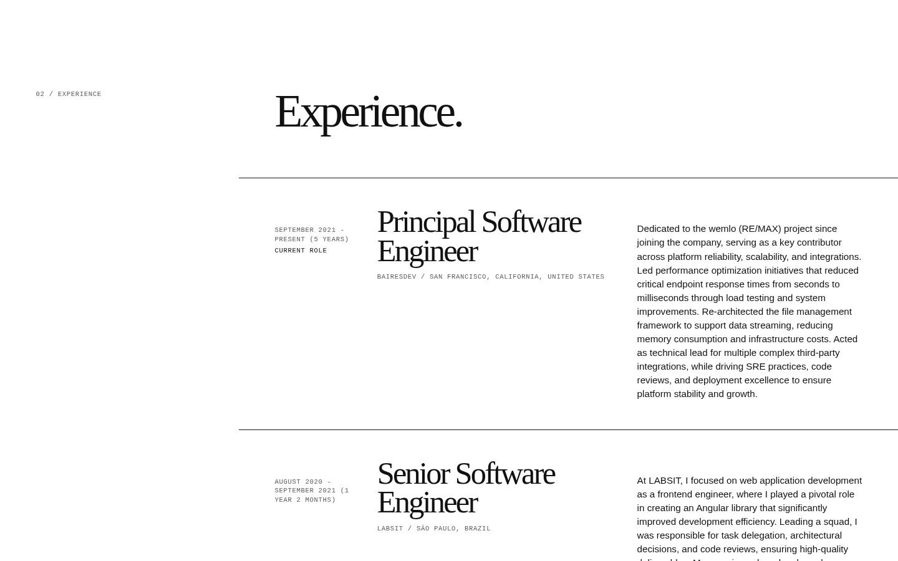
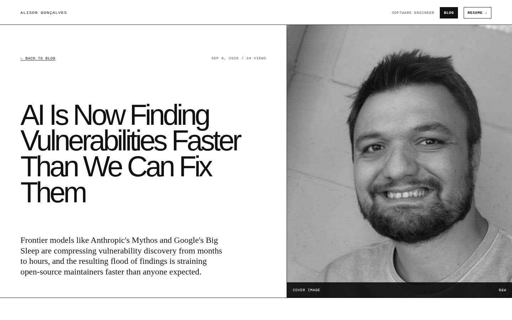
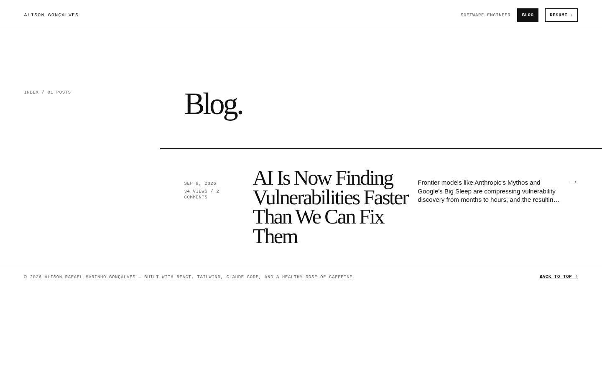
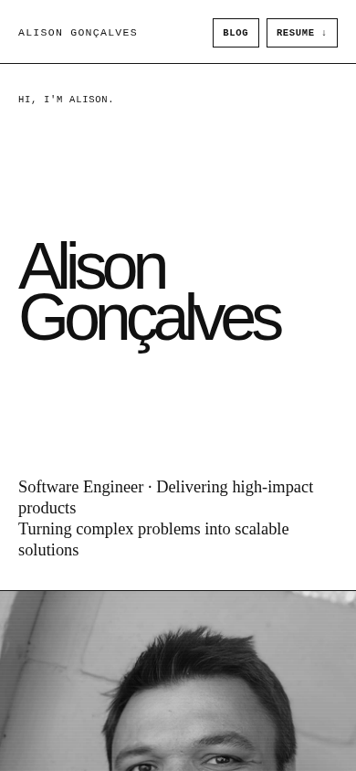
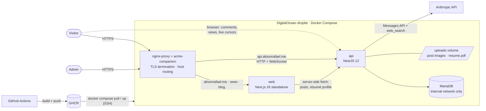
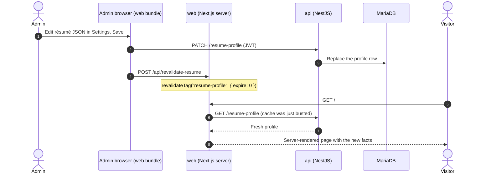

# alisonrafael.me

**A résumé that behaves like a product:** server-rendered, editable without a deploy, with a blog,
an admin panel, and a few AI tools that are explicitly forbidden from inventing facts about my career.

It is the personal site of [Alison Rafael Marinho Gonçalves](https://alisonrafael.me) — a monorepo
with a Next.js frontend, a NestJS API, and a small shared package, self-hosted on a single
DigitalOcean droplet behind Docker. It is deliberately small in scale and deliberately serious in
process: every non-obvious choice is written down as an [ADR](docs/adr) with the trade-off it
accepted and the condition under which it should be revisited.

| | |
|---|---|
| **Résumé** | [alisonrafael.me](https://alisonrafael.me) |
| **Blog** | [blog.alisonrafael.me](https://blog.alisonrafael.me) |
| **API** | `api.alisonrafael.me` (`GET /health`) |

<p>
  
</p>

<table>
  <tr>
    <td width="50%"></td>
    <td width="50%"></td>
  </tr>
  <tr>
    <td align="center"><sub>Numbered sections, full-bleed rows, 1px rules</sub></td>
    <td align="center"><sub>Blog posts reuse the home page's hero</sub></td>
  </tr>
  <tr>
    <td></td>
    <td align="center"></td>
  </tr>
  <tr>
    <td align="center"><sub>The blog index — a row inverts to black on hover</sub></td>
    <td align="center"><sub>The same layout on mobile</sub></td>
  </tr>
</table>

---

## Contents

- [What's in the box](#whats-in-the-box)
- [The interesting parts](#the-interesting-parts)
- [Architecture](#architecture)
- [Repository layout](#repository-layout)
- [Tech stack](#tech-stack)
- [Decision log](#decision-log)
- [Design decisions](#design-decisions)
- [Security and privacy model](#security-and-privacy-model)
- [Getting started](#getting-started)
- [Deployment](#deployment)
- [Testing and quality](#testing-and-quality)
- [How this repo is developed](#how-this-repo-is-developed)
- [Known limitations and revisit triggers](#known-limitations-and-revisit-triggers)
- [License](#license)

---

## What's in the box

**The public site** (`web-client`, Next.js App Router)

- **Résumé** at `/` — hero, career numbers, experience, skills, credentials, contact. Every fact on it
  comes from a database row the Admin edits, not from source code.
- **Blog** at `blog.alisonrafael.me` — a post list and post pages rendered on the server, with real
  per-post `<title>`, description, Open Graph and Twitter tags, canonical URLs, share buttons, a naive
  view counter, and pre-moderated reader comments.
- **Live Cursors** — every visitor on a page sees the other visitors' mouse arrows in real time, in
  the same page's "room". Anonymous, ephemeral, desktop-only.
- **`/sitemap.xml` and `robots.txt`** — the sitemap is generated per request from the published posts
  and lists only canonical URLs.

**The Admin Panel** (`/admin/*`, same Next.js app, single account)

- Post authoring with a live split-preview Markdown editor, drag/paste image upload, and cover images.
- Comment moderation (`pending → approved / rejected`) with a pending-count badge.
- **Tools** — three AI utilities built on the Anthropic API (see below).
- **Settings** — change the password and edit the whole résumé as JSON; saving updates the live site
  immediately.

**The API** (`server`, NestJS + TypeORM + MariaDB) — auth, posts, comments, uploads, the résumé
profile, the AI tools, the résumé PDF download, and the Live Cursors WebSocket gateway.

### The AI tools

| Tool | What it does | The guardrail |
|---|---|---|
| **ATS Resume Generator** | Given a job description, drafts a plain-Markdown, ATS-parseable résumé tailored to it | The prompt may emphasise, reorder and rephrase, but must never add an employer, title, skill, achievement or date that is not in the profile. A human reviews and edits the draft, then **approves** it — only then is it rendered to PDF and published as the site's "Resume ↓" download. |
| **Cover Letter Generator** | Writes a cover letter grounded in the same profile | Same source of truth; nothing is persisted. |
| **Get top trends** | Searches the web for what's drawing attention in software, ranks it against my Tech Stack, and turns the picks I select into draft posts | Discovery returns only a topic and a one-line summary; the expensive deep-dive happens only for trends I actually select. Results are persisted so re-opening the page costs nothing. |

---

## The interesting parts

The parts of this repo that took real thought, in the order I'd show them to another engineer:

1. **One Next.js app answers on three hostnames.** `alisonrafael.me`, `www.` and `blog.` are the same
   container. `src/proxy.ts` canonicalises them: `www → apex` and the old `/blog/*` paths `→ blog.`
   (both `308`), and requests on `blog.` are *internally rewritten* to the `/blog` route tree so the
   address bar shows clean `blog.alisonrafael.me/my-post` URLs ([ADR 0016](docs/adr/0016-blog-on-dedicated-subdomain.md)).
   The price — in-page links must know which host they're on — is paid in one small module
   (`src/blog/routes.ts`) rather than scattered through components.
2. **The résumé is data, and data reaches production without a build.** Facts live in one JSON row.
   The public page fetches it with a Next.js Data Cache tag; saving in Settings calls
   `revalidateTag('resume-profile', { expire: 0 })` so the *very next* visit is fresh
   ([ADR 0015](docs/adr/0015-resume-profile-becomes-db-backed-and-editable.md)). The same row feeds
   the AI tools, so one edit updates the site *and* every generated document.
3. **AI that is grounded, gated and honest about cost.** Generated résumés are constrained to the
   profile and require explicit human approval; trend discovery was redesigned after real usage showed
   it burning its token budget on work the user then discarded
   ([ADR 0007](docs/adr/0007-anthropic-api-for-trend-discovery.md), including its three later revisions).
   Long-running calls stream Server-Sent Events with Claude's live reasoning, so a job that takes a minute or
   more reads as progress instead of a frozen spinner — and that took a raw `@Res()` handler and an
   `X-Accel-Buffering: no` header to survive nginx.
4. **A tiny real-time system, scoped on purpose.** Live Cursors is a Socket.IO gateway with three room
   types (`home`, `blog`, `post:<slug>`), a per-connection throttle of ~20 events/s, positions
   normalised against the *document* (not the viewport) so an arrow scrolls with the page, and zero
   persistence or identity ([ADR 0017](docs/adr/0017-live-cursors-unauthenticated-per-room-websocket-gateway.md)).
5. **Link previews without client JavaScript.** Social crawlers don't run JS. The first attempt
   injected `<head>` tags into a SPA shell — it worked, and was thrown away because the *content* was
   still client-rendered. The fix was a full migration to real SSR
   ([ADR 0011](docs/adr/0011-per-post-link-previews-via-server-rendered-blog-html.md) →
   [ADR 0013](docs/adr/0013-migrate-web-client-to-nextjs-app-router.md)).
6. **The public page ships almost no JavaScript of its own.** Every résumé section is a Server
   Component; the only client island on `/` is the Live Cursors overlay.
7. **Decisions and vocabulary are first-class artefacts.** [`CONTEXT.md`](CONTEXT.md) is a glossary
   with "_Avoid_" terms (a *Visitor* is not a *User*; a *Post* is not an *Article*), and
   [`docs/adr/`](docs/adr) holds sixteen decision records — including the ones that were reversed.

---

## Architecture



### Which host serves what

| Request | What happens |
|---|---|
| `alisonrafael.me/` | The résumé. |
| `www.alisonrafael.me/*` | `308` → the apex host. |
| `alisonrafael.me/blog` and `/blog/*` | `308` → `blog.alisonrafael.me/` and `/*` (one canonical URL per post). |
| `blog.alisonrafael.me/` | Internally rewritten to the `/blog` route: the post list. |
| `blog.alisonrafael.me/<slug>` | Internally rewritten to `/blog/<slug>`: a post. |
| `blog.` paths containing a `.` | Passed through untouched, so `public/` assets (`avatar.png`, `robots.txt`, …) and route-generated files like `sitemap.xml` (from `app/sitemap.ts`) still resolve. |
| `localhost:5173/blog` (dev) | No rewrite fires; the real `/blog` path is used. |

### From an Admin edit to the live site



The profile is also read, at call time, by the Cover Letter and ATS Résumé generators — so the same
edit reaches every AI-written document without a redeploy.

---

## Repository layout

An npm-workspaces monorepo ([ADR 0002](docs/adr/0002-npm-workspaces-monorepo.md)).

```text
.
├── web-client/               Next.js 16 (App Router, output: 'standalone') — résumé, blog, admin
│   └── src/
│       ├── app/              Routes: /, /blog, /blog/[slug], /admin/*, /sitemap.xml, /api/revalidate-resume
│       ├── components/       Résumé page: SiteHeader, Hero, About, Experience, Skills, Credentials, Contact, Footer
│       ├── blog/             Blog data access, host-aware URL helpers, comments / share / view-counter islands
│       ├── admin/            Admin Panel pages and components (entirely client-rendered)
│       ├── live-cursors/     Socket.IO client + the cursor overlay
│       ├── content/ i18n/    Static UI copy + the merge with the live résumé profile
│       └── proxy.ts          Host canonicalisation and the blog.* rewrite
├── server/                   NestJS 12 API
│   ├── src/                  auth · blog · comments · uploads · resume-profile · ats-resume · tools ·
│   │                         trends · live-cursors · health
│   └── assets/               Bundled seed PDF so the download link is never dead on first boot
├── shared/                   @portifolio/shared — data both apps need (Tech Stack, résumé defaults)
├── deploy/proxy/             The shared nginx-proxy + acme-companion stack (deployed once, by hand)
├── docs/adr/                 Architecture Decision Records
├── docs/img/                 Screenshots used by this README
├── CONTEXT.md                Domain glossary — the project's ubiquitous language
├── CLAUDE.md                 Working notes for AI coding agents (architecture map, gotchas)
├── docker-compose.yml        Production stack: web + api + mariadb
├── docker-compose.local.yml  Local-development database only
└── .github/workflows/deploy.yml   Build both images → GHCR → deploy over SSH
```

---

## Tech stack

| Layer | Choice | Why |
|---|---|---|
| Frontend | **Next.js 16** (App Router, standalone output), **React 19**, TypeScript | Real per-route SSR, `generateMetadata` for link previews, Server Components for a near-zero-JS résumé — [ADR 0013](docs/adr/0013-migrate-web-client-to-nextjs-app-router.md) |
| Styling | **Tailwind CSS v4** (CSS-first `@theme`, no config file) | Design tokens live in one CSS file; the public site is strictly monochrome with system fonts |
| Markdown | `react-markdown` (public, server-side) · `@uiw/react-md-editor` (admin, client-only) | The renderer never reaches the client bundle |
| Backend | **NestJS 12**, TypeORM, **MariaDB 11** (`mysql2`) | Simple relational data; modules and DI keep a growing API tidy — [ADR 0003](docs/adr/0003-mariadb-typeorm-backend-datastore.md) |
| Auth | `@nestjs/jwt` + Passport (`passport-jwt`), bcrypt | One Admin account, 24 h token — [ADR 0006](docs/adr/0006-admin-session-model.md) |
| Real time | `@nestjs/websockets` + Socket.IO | Built-in rooms map exactly onto the per-page model — [ADR 0017](docs/adr/0017-live-cursors-unauthenticated-per-room-websocket-gateway.md) |
| AI | `@anthropic-ai/sdk` — Claude Sonnet 5 (discovery, drafting, résumé, cover letter), Haiku 4.5 (ranking), `web_search` server tool | No separate search API to run — [ADR 0007](docs/adr/0007-anthropic-api-for-trend-discovery.md) |
| PDF | `pdfkit` with a small hand-rolled Markdown renderer (server) · `jspdf` (cover letter, client) | The ATS résumé is deliberately plain — [ADR 0014](docs/adr/0014-ats-resume-generator-replaces-static-download.md) |
| Validation | `class-validator` / `class-transformer`, global `ValidationPipe` (`whitelist`, `forbidNonWhitelisted`) | Undeclared fields are rejected outright |
| Tooling | npm workspaces, `oxlint`, `vitest`, Playwright (dev dependency) | |
| Infra | Docker, `nginx-proxy` + `acme-companion`, GitHub Actions, GHCR, one droplet | [ADR 0001](docs/adr/0001-nginx-proxy-acme-companion-for-tls.md) |

---

## Decision log

Sixteen ADRs live in [`docs/adr/`](docs/adr) (the numbering skips `0012` on purpose: it was the
abandoned implementation record described in ADRs 0011 and 0013 and was never committed). Below, each
one is a single line: **what was decided**, and **what it cost**.

### Infrastructure and repo shape

| ADR | Decision | Trade-off accepted |
|---|---|---|
| [0001](docs/adr/0001-nginx-proxy-acme-companion-for-tls.md) | `nginx-proxy` + `acme-companion` for routing and TLS; new services join by setting `VIRTUAL_HOST` / `LETSENCRYPT_HOST` | Less direct control of nginx than a hand-written config; chosen over Caddy because several independently deployed containers sit behind it |
| [0002](docs/adr/0002-npm-workspaces-monorepo.md) | One npm-workspaces monorepo (single lockfile) | Docker builds must use the **repo root** as context |
| [0008](docs/adr/0008-shared-workspace-for-cross-app-data.md) | A `shared/` workspace for data both apps need (Tech Stack, résumé defaults) | Ended `web-client`'s self-contained build — knowingly, because two hand-synced copies would drift silently |

### Backend and data

| ADR | Decision | Trade-off accepted |
|---|---|---|
| [0003](docs/adr/0003-mariadb-typeorm-backend-datastore.md) | MariaDB + TypeORM, `synchronize: true` | No migrations yet — fine while there is no hand-migrated schema to protect; **revisit before data is at stake** |
| [0004](docs/adr/0004-local-disk-image-storage.md) | Uploads on a Docker volume, served by the API itself | No CDN, no backups beyond the droplet's; moving to object storage later needs a one-off migration |
| [0014](docs/adr/0014-ats-resume-generator-replaces-static-download.md) | AI-drafted, human-approved résumé PDF replaces a git-committed `resume.pdf` | A hand-rolled Markdown→PDF renderer — acceptable because the prompt constrains output to headings, bullets and paragraphs. A bundled seed PDF keeps the link alive on first boot |
| [0015](docs/adr/0015-resume-profile-becomes-db-backed-and-editable.md) | Résumé facts live in one JSON row, edited as raw JSON, revalidated on save | JSON editing instead of a form builder (the only editor already edits exactly this shape); `{ expire: 0 }` over `'max'` because correctness beats a perf win this traffic doesn't need |
| [0007](docs/adr/0007-anthropic-api-for-trend-discovery.md) | Anthropic SDK + built-in `web_search` for trend discovery and drafting; synchronous, streamed over SSE | A paid third-party dependency; no job queue (one admin, occasional use) |

### Product, security and real time

| ADR | Decision | Trade-off accepted |
|---|---|---|
| [0005](docs/adr/0005-admin-panel-in-web-client.md) | The Admin Panel is routes inside `web-client`, not a separate app | Admin code ships in the same codebase (now split per route by Next.js automatically) |
| [0006](docs/adr/0006-admin-session-model.md) | JWT in `localStorage`, 24 h, no refresh token | Acceptable because the Admin Panel never renders visitor-supplied content; avoids CORS credentials + CSRF machinery |
| [0009](docs/adr/0009-reader-comments-pre-moderated-pseudonymous-one-level-rate-limited.md) | Comments are pre-moderated, pseudonymous, one level deep, rate-limited (5 per IP per hour) | The limiter is in-memory and per-process; the schema's first relations arrive under `synchronize: true` |
| [0010](docs/adr/0010-view-counter-intentionally-undeduplicated.md) | View count is a naive, atomic increment on its own `POST` endpoint | Refresh inflation is accepted; no IPs are stored |
| [0017](docs/adr/0017-live-cursors-unauthenticated-per-room-websocket-gateway.md) | Live Cursors: unauthenticated, in-memory, per-page rooms, throttled | Cursors can never be attributed to anyone; touch devices get nothing; state dies on restart |

### Frontend delivery

| ADR | Decision | Trade-off accepted |
|---|---|---|
| [0011](docs/adr/0011-per-post-link-previews-via-server-rendered-blog-html.md) | *(Superseded)* inject per-post `<head>` tags into a SPA shell | Built, verified, then abandoned: it fixed the symptom but not the client-rendered content |
| [0013](docs/adr/0013-migrate-web-client-to-nextjs-app-router.md) | Migrate the whole frontend to Next.js for real SSR; **leave the NestJS API untouched** | A full frontend rewrite; `/admin/*` stays client-rendered because the JWT lives in `localStorage` where Server Components can't see it |
| [0016](docs/adr/0016-blog-on-dedicated-subdomain.md) | Serve the blog at `blog.alisonrafael.me` from the *same* app | Host-aware link helpers; a redirect for every old `/blog/*` URL |

### Decisions without an ADR

Smaller choices that are settled but not hard to reverse, so they never earned a record of their own:

| Decision | Why |
|---|---|
| **Two caching regimes.** Blog pages, comments and the sitemap fetch with `cache: 'no-store'`; the résumé profile is tag-cached *indefinitely* and busted on demand | A just-approved comment or a fresh view count should show on the next load; the résumé changes only on a deliberate Admin save, so it should never re-fetch needlessly |
| **English-only, and no i18n library** — a plain `locales` map in `src/i18n/index.ts` | Adding a language means adding one typed file (`src/content/<locale>.ts`) and registering it; a library would be machinery for a feature with no second locale |
| **`NEXT_PUBLIC_API_URL` is baked in at build time** and committed in `.env.production` | It is just the API's public hostname, not a secret; Next inlines `NEXT_PUBLIC_*` at build, and there is no runtime env injection in this deployment |
| **The résumé page falls back to bundled seed data if the API is unreachable** | `next build` prerenders against whichever API is live, which on a first deploy is the *previous* release; failing the build over that would be worse than briefly showing seed content |
| **Server Components by default**; a file is `'use client'` only when it touches browser APIs | Keeps the public page's JavaScript to a single island (Live Cursors) |
| **The sitemap lists canonical URLs only** (apex home, `blog.` index and posts) — never `www.` or `/blog/*` on the apex | Those are redirect sources; a sitemap entry that redirects is noise for crawlers |
| **`robots.txt` is static** and disallows `/admin/` | Nothing about it varies per request |

### Decisions that were reversed or revised (kept in the log on purpose)

- **SPA + injected `<head>` → Next.js SSR** — ADR 0011 was built, tested and thrown away.
- **Trend Searches: ephemeral → persisted** — opening the page used to cost a paid search every time.
- **Trend discovery: full write-ups up front → topic + summary only** — the first version spent its
  whole token budget before returning anything the admin would read.
- **Trend endpoints: blocking JSON → streamed SSE** — same synchronous model, but the wait now looks
  like progress.

### A recurring principle

Almost every decision above is the same move: **size the solution to a single-admin, low-traffic
site, write down the shortcut, and name the trigger that should end it** — `synchronize: true`, an
in-memory rate limiter, local-disk uploads, an undeduplicated counter, no job queue, raw-JSON editing.
Each is cheap now and has a stated exit; none is hidden.

---

## Design decisions

The visual system is modelled closely on [lucasmontano.com](https://lucasmontano.com/) — its layout,
type scale and interaction patterns — re-implemented from scratch in Tailwind. All content and imagery
are my own. It went through several iterations (dark terminal theme → light → flat → a full structural
rebuild), and the rules that survived are:

- **Strictly black and white.** One ink colour, one soft-ink for secondary text, two rule weights
  (a full-strength divider between sections, a quiet hairline inside them). No accent colour.
- **System font stacks, no web fonts.** Helvetica-style sans for the display name and body copy, a
  serif for headlines and statements, a monospace for tiny uppercase labels. Zero font requests.
- **Square corners and 1px rules instead of cards.** Hierarchy comes from type scale and whitespace,
  not boxes, shadows or pills.
- **Numbered sections in a two-column grid** — a narrow mono index rail (`02 / Experience`) beside a
  large serif headline and body. The same grid structures the blog post page.
- **Lists are rows.** Experience and the blog index are full-bleed rows separated by rules; on the blog
  a row inverts to black on hover and its arrow slides.
- **No scroll or entrance animation.** Combined with Server Components, the résumé page is HTML plus
  one client island.
- **The portrait is styled, not edited.** `avatar.png` stays in colour on disk; grayscale, contrast and
  a faint scanline overlay are applied in CSS.
- **Accent tokens are kept as aliases of ink.** The Admin Panel shares the same `@theme` tokens and
  still styles its buttons with `bg-accent`; deleting the tokens would leave it with invisible
  buttons, so they resolve to the ink colour instead. The Admin simply inherits the monochrome palette.

---

## Security and privacy model

| Surface | Posture |
|---|---|
| **Admin** | Exactly one account, seeded once from `ADMIN_EMAIL` / `ADMIN_PASSWORD` on first boot (never re-applied). `bcrypt` password hashes; a 24 h JWT; every admin route behind `JwtAuthGuard`. No route can manage any *other* account. |
| **Input validation** | Global `ValidationPipe` with `whitelist` and `forbidNonWhitelisted` — undeclared fields are a `400`. |
| **CORS** | Explicit allow-list from `CORS_ORIGIN`, applied to both Express and Socket.IO (one list, one place). |
| **Reader comments** | Created `pending`, invisible until approved; 5 submissions per IP per hour; the optional email is `select: false` at the ORM level so a public query cannot leak it. |
| **Live Cursors** | Unauthenticated by design; a cursor carries only a colour and a percentage position; room names are validated against a strict pattern at the handshake; ~20 events/s per connection. |
| **Uploads** | Admin-only; images only (JPEG, PNG, WebP, GIF), 5 MB cap. |
| **Public résumé download** | `GET /resume` is intentionally unguarded — it serves the PDF the Admin approved. |
| **`POST /api/revalidate-resume`** | Intentionally unguarded: it only busts a cache tag and mutates nothing. |
| **Analytics** | None. No tracking scripts, no cookies; the view counter is a naive integer, not analytics. |
| **Secrets** | Live only in GitHub Actions secrets; the deploy job writes a `chmod 600` `.env` on the droplet each time. MariaDB is on an internal Docker network with no published port. |

---

## Getting started

### Prerequisites

- **Node.js 22+** (the Docker images use 22; newer works) and npm
- **Docker** — for the local MariaDB
- An **Anthropic API key** — see the note below; the API will not boot without one set

### Run it locally

```bash
git clone git@github.com:armgalison/alisonrafael.me.git
cd alisonrafael.me
npm install

# web-client and server import shared's *compiled* output — build it first (and after editing shared/).
npm run build:shared

# 1. A database on localhost:3306 (its volume is separate from the deploy stack's)
export DB_PASSWORD=devpassword
docker compose -f docker-compose.local.yml up -d

# 2. API config
cp server/.env.example server/.env
#    then edit server/.env — see the notes below

# 3. Run both apps (two terminals)
npm run dev:api      # NestJS on http://localhost:3000
npm run dev:web      # Next.js on http://localhost:5173
```

MariaDB needs a few seconds to initialise on first start (the compose file has a healthcheck — wait for
`docker compose -f docker-compose.local.yml ps` to show `healthy`) before the API can connect.

Open <http://localhost:5173>. The blog is at <http://localhost:5173/blog> (there is no subdomain
rewrite in dev), and the Admin Panel at <http://localhost:5173/admin/login> — sign in with the `ADMIN_EMAIL` /
`ADMIN_PASSWORD` you put in `server/.env`. If the API is down, the résumé still renders from bundled
seed content.

**Notes on `server/.env`:**

- **`ANTHROPIC_API_KEY` must be set to something**, even if you never use the Tools — the three AI
  services read it in their constructors, so the API refuses to start without it. A placeholder is
  fine for everything except the Tools themselves.
- **`CORS_ORIGIN=http://localhost:5173`** — the example file lists the production origins, which would
  make the browser block the API calls the Admin Panel, comments and Live Cursors make.
- `DB_PASSWORD` must match what you exported for Docker.
- `ADMIN_EMAIL` / `ADMIN_PASSWORD` seed the Admin **only if no admin exists yet**; changing them later
  does nothing.
- The résumé profile seeds itself from `shared/src/resume.ts` on first boot; after that, edit it from
  the Admin Panel's Settings page.

`web-client` reads `NEXT_PUBLIC_API_URL` from `.env.development` (`http://localhost:3000`) — it is
baked in at build time, which is why production has its own committed `.env.production`. If you use
[direnv](https://direnv.net/), you can export the same variables from a (git-ignored) `.envrc` instead
of using `server/.env`.

### Commands

| Command | What it does |
|---|---|
| `npm run dev:web` | Next.js dev server (Turbopack), pinned to **5173** so it never collides with the API's 3000 |
| `npm run dev:api` | NestJS in watch mode |
| `npm run build` | Build `shared`, then `web-client`, then `server` |
| `npm run typecheck --workspace=web-client` | `tsc --noEmit` |
| `npm run lint --workspace=web-client` / `--workspace=server` | `oxlint` |
| `npm run test:e2e --workspace=server` | The end-to-end smoke test (`GET /health`); needs the database running |
| `npm run start --workspace=web-client` | Run the **standalone** production build locally (`next start` does not work with `output: 'standalone'`) |
| `docker build -f web-client/Dockerfile .` / `-f server/Dockerfile .` | Build the images — note the **repo root** is the context |

### Gotchas worth knowing

- `server/tsconfig.json` uses `"module": "nodenext"` — **every relative import needs an explicit `.js`
  extension**, even for files that don't exist yet.
- `shared` must be built before either consumer; both import its `dist/`, not its source.
- Next.js 16 is newer than most documentation — `web-client/AGENTS.md` says to read
  `node_modules/next/dist/docs/` before assuming an API. (`middleware` is now `proxy`, for one.)

---

## Deployment

Push to `main` and [`deploy.yml`](.github/workflows/deploy.yml) does the rest:

1. **Build** both Docker images in a matrix job and push them to GitHub Container Registry, tagged
   `latest` and by commit SHA, with a GitHub Actions layer cache.
2. **Sync** `docker-compose.yml` to the droplet (the repo is not cloned there, so this is the only way
   the compose file stays current).
3. **Deploy** over SSH: write `.env` from repository secrets, `docker compose pull`, `up -d
   --remove-orphans`, prune old images.

Because the deploy job `needs` the build job, a broken image build blocks the release.

**One-time droplet setup**

```bash
docker network create nginx-proxy
cd deploy/proxy && docker compose up -d       # the shared reverse proxy — deployed once, by hand
```

Then point DNS `A` records for `alisonrafael.me`, `www`, `blog` and `api` at the droplet. New
containers join simply by setting `VIRTUAL_HOST` / `LETSENCRYPT_HOST` — certificates are issued
automatically ([ADR 0001](docs/adr/0001-nginx-proxy-acme-companion-for-tls.md)).

**Repository secrets:** `DROPLET_HOST`, `DROPLET_USER`, `DROPLET_SSH_KEY`, `DROPLET_APP_DIR`,
`DB_ROOT_PASSWORD`, `DB_PASSWORD`, `JWT_SECRET`, `ADMIN_EMAIL`, `ADMIN_PASSWORD`, `ANTHROPIC_API_KEY`.

**Operational details that are easy to miss**

- The proxy stack is deliberately independent of the app's deploy: a push to `main` **never** updates
  it. `deploy/proxy/vhost.d/api.alisonrafael.me` raises proxy timeouts to 180 s because the AI
  endpoints legitimately run for a minute or more — changes to it have to be copied to the droplet by hand.
- `web` sets `VIRTUAL_PORT: 3000` explicitly instead of relying on nginx-proxy's port auto-detection
  (the old static-nginx image listened on 80; the Next.js standalone server listens on 3000).
- The API sets `trust proxy` so `req.protocol` and `req.ip` are correct behind TLS termination — image
  URLs come back as `https://`, and the comment rate limiter sees real client IPs.
- Two named volumes hold state: `mariadb-data` and `uploads-data` (post images **and** the approved
  `resume.pdf`). The container filesystem is recreated on every deploy; these are not.

---

## Testing and quality

An honest account, because a README that oversells its tests is worse than none:

- **Automated tests are minimal.** There is one end-to-end smoke test (`server/test/app.e2e-spec.ts`,
  `GET /health`, which needs a database) and **no unit tests**. `npm run test` in `server` finds no
  `*.spec.ts` files and exits non-zero.
- **The gates that actually run:** `tsc --noEmit` (strict, with `noUnusedLocals` / `noUnusedParameters`)
  on `web-client` and `oxlint` on both apps in development; `nest build` and `next build` (which
  type-checks and prerenders) inside the Docker builds that CI must pass before deploying. There is no separate CI lint or test job.
- **Behaviour is verified by driving the running system** — for example the Live Cursors gateway was
  exercised with real Socket.IO clients (broadcast, late-join snapshot, room isolation, invalid-room
  rejection, throttling, disconnect propagation) and the UI with Playwright.

If I were adding one thing, it would be integration tests for the comment moderation state machine and
the résumé-approval flow — the two places where a silent regression would be publicly visible.

---

## How this repo is developed

- **Scope is decided by interview, not by drift.** Features start as a structured design interview
  (a "grilling" session) that walks the decision tree branch by branch, using [`CONTEXT.md`](CONTEXT.md)
  to challenge fuzzy language before any code is written. Live Cursors, for example, was settled by
  asking about room granularity, identity, touch devices and abuse limits *first*.
- **A shared vocabulary.** [`CONTEXT.md`](CONTEXT.md) defines each domain term, the rules that govern
  it (a comment is `pending` until approved; a Live Cursor never outlives its connection), and the
  words *not* to use for it.
- **ADRs are written sparingly**, only when a choice is hard to reverse, surprising without context,
  and the result of a real trade-off. Reversals are recorded, not erased.
- **AI-assisted, human-directed.** Much of the code was written with Claude Code.
  [`CLAUDE.md`](CLAUDE.md) is the agent-facing map of the codebase, and [`.claude/skills`](.claude/skills)
  holds the workflows (grilling, domain-modelling, code review, …) that keep that assistance consistent.

---

## Known limitations and revisit triggers

Everything below is a known, accepted cost — with the condition that should end it.

| Limitation | Revisit when |
|---|---|
| `synchronize: true`, no migrations ([0003](docs/adr/0003-mariadb-typeorm-backend-datastore.md), [0009](docs/adr/0009-reader-comments-pre-moderated-pseudonymous-one-level-rate-limited.md)) | The schema stabilises or holds data that can't be regenerated |
| Uploads on local disk; orphaned files are never deleted ([0004](docs/adr/0004-local-disk-image-storage.md)) | Upload volume or reliability needs grow |
| The comment limiter and Live Cursors state are **in-process memory** ([0009](docs/adr/0009-reader-comments-pre-moderated-pseudonymous-one-level-rate-limited.md), [0017](docs/adr/0017-live-cursors-unauthenticated-per-room-websocket-gateway.md)) | The API runs more than one replica — rooms and counters would then be split per instance |
| No comment notifications — the server has no email capability ([0009](docs/adr/0009-reader-comments-pre-moderated-pseudonymous-one-level-rate-limited.md)) | Comment volume makes checking the badge impractical |
| AI endpoints hold an HTTP request open for the whole run; no job queue ([0007](docs/adr/0007-anthropic-api-for-trend-discovery.md)) | These need to run unattended or often |
| The résumé is edited as raw JSON ([0015](docs/adr/0015-resume-profile-becomes-db-backed-and-editable.md)) | JSON editing proves error-prone |
| The Admin JWT is in `localStorage`, so `/admin/*` cannot be server-rendered or server-protected ([0006](docs/adr/0006-admin-session-model.md), [0013](docs/adr/0013-migrate-web-client-to-nextjs-app-router.md)). ADR 0006 predates comments; the Comments page now shows visitor-written text, which is rendered as escaped plain text, never HTML | The Admin Panel ever renders untrusted content as markup, or needs SSR |
| The view counter counts refreshes ([0010](docs/adr/0010-view-counter-intentionally-undeduplicated.md)) | The number starts to matter |
| Live Cursors are desktop-only and anonymous forever ([0017](docs/adr/0017-live-cursors-unauthenticated-per-room-websocket-gateway.md)) | Never, by design — layering identity on top would be a redesign |
| Some older ADRs still name components that have since been replaced (e.g. `Nav.tsx`, now `SiteHeader.tsx`) | They describe the decision at the time it was made; `CLAUDE.md` tracks the current code |

---

## License

ISC, as declared in [`package.json`](package.json).
